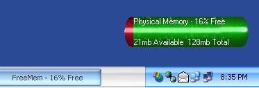



## FreeMem

### Description

This program uses Api calls to get the current free physical memory, then both prints and shows you graphically the data. The project uses a borderless form so you can move it around with a simple mouse click.
 
### More Info
 

             |
---                |---
**Submitted On**   |2002-04-11 15:33:14
**By**             |[Spinflip](https://github.com/Planet-Source-Code/PSCIndex/blob/master/ByAuthor/spinflip.md)
**Level**          |Intermediate
**User Rating**    |5.0 (30 globes from 6 users)
**Compatibility**  |VB 6\.0
**Category**       |[Miscellaneous](https://github.com/Planet-Source-Code/PSCIndex/blob/master/ByCategory/miscellaneous__1-1.md)
**World**          |[Visual Basic](https://github.com/Planet-Source-Code/PSCIndex/blob/master/ByWorld/visual-basic.md)
**Archive File**   |[FreeMem710804112002\.zip](https://github.com/Planet-Source-Code/spinflip-freemem__1-33704/archive/master.zip)

